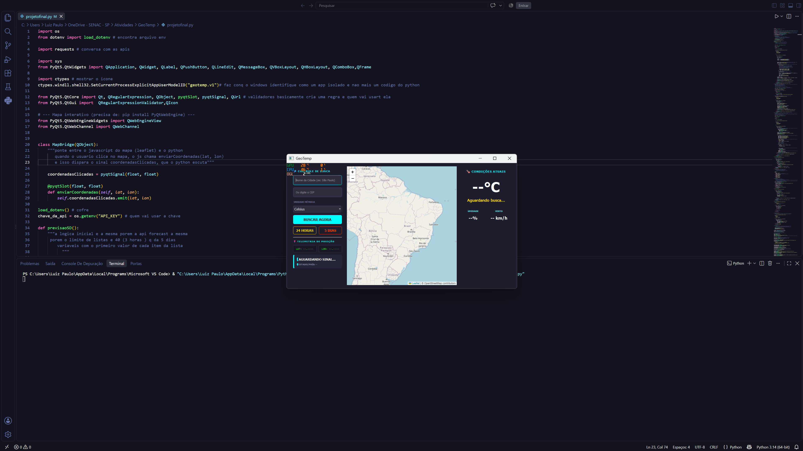
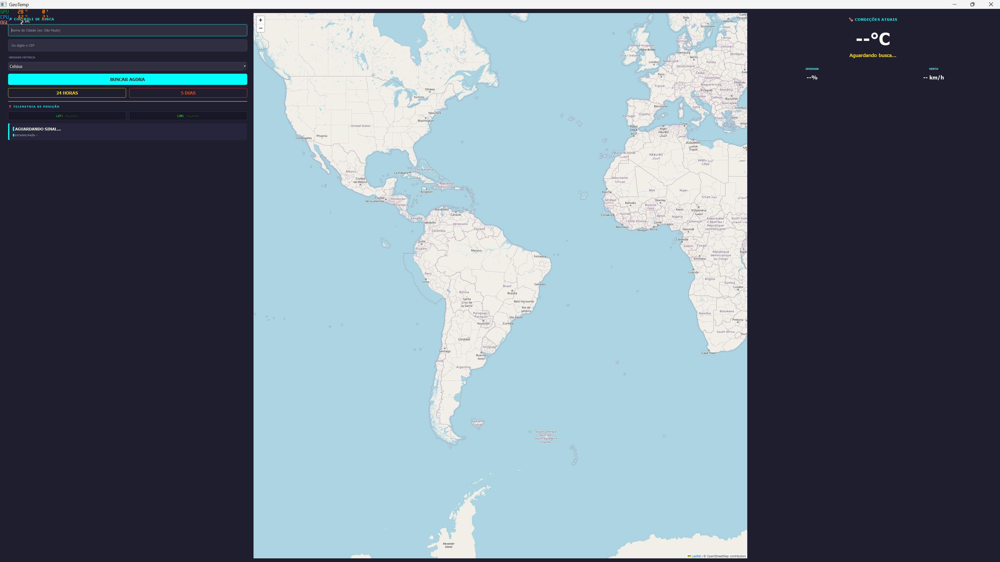

# 🌍 GeoTemp — Clima em Tempo Real

Aplicação desktop dark com interface estilo painel de controle que exibe temperatura atual, previsão para 24 horas e previsão semanal de qualquer cidade. A busca pode ser feita por nome da cidade, CEP, ou clicando diretamente no mapa interativo.

> 🚧 Projeto em andamento — funcionalidades principais implementadas, mapa interativo adicionado, melhorias visuais em desenvolvimento.

---

## ⚡ Funcionalidades

| Funcionalidade | Descrição |
|---|---|
| Temperatura atual | Busca clima em tempo real — temperatura, descrição, umidade e vento |
| Previsão 24 horas | Tabela com intervalos de 3 horas mostrando temp, clima e vento |
| Previsão 5 dias | Relatório com mínima e máxima por dia |
| Busca por cidade ou CEP | Aceita nome da cidade ou CEP — converte automaticamente via ViaCEP |
| **Mapa interativo** | Clique em qualquer ponto do mapa (Leaflet) para buscar a temperatura daquele local automaticamente |
| Validação dupla | Se cidade e CEP forem informados, verifica se o CEP pertence àquela cidade |
| Unidade de temperatura | Celsius, Fahrenheit ou Kelvin — selecionável na interface |
| Telemetria de posição | Exibe latitude e longitude da cidade buscada |

<p align="center">
  
  
</p>

---

## 🛠️ Tecnologias

- Linguagem: **Python 3**
- Interface: **PyQt5** + **PyQtWebEngine** (mapa interativo)
- Mapa: **Leaflet.js** rodando dentro de um `QWebEngineView`, comunicando com o Python via `QWebChannel`
- APIs: **OpenWeatherMap** (clima, geolocalização e geolocalização reversa) · **ViaCEP** (conversão de CEP)
- Segurança: **.env** para proteger a chave da API (primeira vez usando variáveis de ambiente)
- Controle de versão: **.gitignore** configurado para não expor a chave no GitHub

---

## 🗺️ Mapa interativo

O painel central agora exibe um mapa mundial (OpenStreetMap via Leaflet). Ao clicar em qualquer ponto:

1. O JavaScript do mapa captura a latitude e longitude do clique
2. Essas coordenadas são enviadas ao Python através de um `QWebChannel`
3. O app faz uma geolocalização reversa para descobrir o nome do local
4. A temperatura atual daquele ponto é buscada e exibida automaticamente

---

## 🔐 Primeira vez com .env e .gitignore

Este projeto marca a primeira vez usando boas práticas de segurança:

- A chave da API fica no arquivo `.env` — nunca aparece no código
- O `.gitignore` impede que o `.env` seja enviado ao GitHub
- O repositório inclui um `.env.exemplo` mostrando quais variáveis são necessárias

---

## ⚙️ Como executar

<details>
<summary>🔑 Configurar a chave da API</summary>

Crie uma conta gratuita em [openweathermap.org](https://openweathermap.org/api) e gere sua API key.

Renomeie o arquivo `.env.exemplo` para `.env` e cole sua chave:

```
API_KEY=sua_chave_aqui
```

</details>

<details>
<summary>📥 Instalar e rodar</summary>

### 1. Instale as dependências
```bash
pip install PyQt5 PyQtWebEngine requests python-dotenv
```

### 2. Configure o .env (veja acima)

### 3. Execute
```bash
python projetofinal.py
```

</details>

<details>
<summary>🔀 Clonar o repositório</summary>

### 1. Clone
```bash
git clone https://github.com/LuizPauloSoares/GeoTemp.git
```

### 2. Acesse a pasta
```bash
cd GeoTemp
```

### 3. Instale as dependências
```bash
pip install PyQt5 PyQtWebEngine requests python-dotenv
```

### 4. Configure o .env e execute
```bash
python projetofinal.py
```

</details>

---

## 👤 Autor

**Luiz Paulo Soares**  
Desenvolvedor back-end | Python · Java · SQL Server  
[](https://linkedin.com/in/luiz-paulo-soares)
[](https://github.com/LuizPauloSoares)
